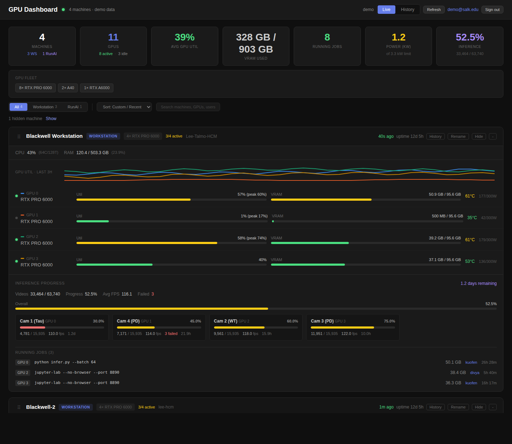

# GPU Dashboard

Monitor GPUs across multiple workstations from a single web page. No server required.



## How It Works

```
Workstation 1  ──push──►                              ◄──read── GitHub Pages
Workstation 2  ──push──►  GitHub Gist (JSON store)    ◄──       Dashboard
RunAI Pod      ──push──►
```

A lightweight Python agent runs on each machine, collects GPU/CPU/RAM stats every 30 seconds, and pushes them to a GitHub Gist. The dashboard (a static HTML page on GitHub Pages) reads the Gist and displays everything.

- **No server needed** — GitHub Gist is the data store, GitHub Pages hosts the dashboard
- **No inbound ports** — agents push outbound to GitHub API
- **Auto-pause** — stops polling when you switch browser tabs
- **Works anywhere** — Ubuntu workstations, RunAI, any machine with `nvidia-smi` and Python

## What It Shows

| Per Machine | Per GPU | Per Process |
|-------------|---------|-------------|
| CPU usage & core count | Utilization % | Command line |
| RAM usage | VRAM usage | GPU memory |
| Uptime | Temperature | User |
| Freshness (last report) | Power draw | Runtime |

## Quick Start (Add Your Machine)

No clone needed. Just run this on any machine with `nvidia-smi` and Python:

```bash
# One-liner: download and run the installer
curl -sL https://raw.githubusercontent.com/LeoMeow123/vibes/main/gpu-dashboard/agent/install.sh -o /tmp/gpu-install.sh && \
curl -sL https://raw.githubusercontent.com/LeoMeow123/vibes/main/gpu-dashboard/agent/gpu_agent.py -o /tmp/gpu_agent.py && \
curl -sL https://raw.githubusercontent.com/LeoMeow123/vibes/main/gpu-dashboard/agent/config.json -o /tmp/config.json && \
SCRIPT_DIR=/tmp bash /tmp/gpu-install.sh
```

The installer will prompt you for:
1. **Gist ID** — ask the dashboard owner for this
2. **GitHub Token** — a [Personal Access Token](https://github.com/settings/tokens) with `gist` scope only
3. **Machine label** — display name (e.g. "My Workstation")
4. **Machine type** — `workstation` or `runai`

It automatically:
- Installs the agent to `~/.local/bin/gpu-agent`
- Sets up a systemd service (auto-starts on boot)
- Runs a dry-run test to verify everything works

That's it. Open the [dashboard](https://leomeow123.github.io/vibes/gpu-dashboard/) to see your machine.

### If you already have VAST access

Even simpler — the files are already on VAST:
```bash
# From any machine with VAST mounted:
bash /path/to/vast/leo/vibing/gpu-dashboard/agent/install.sh
```

### First-time setup (dashboard owner only)

If you're setting up a NEW dashboard from scratch:

1. Create a **secret** [GitHub Gist](https://gist.github.com) with any content → copy the Gist ID from the URL
2. Create a [Personal Access Token](https://github.com/settings/tokens) → classic → check only `gist` → Generate
3. Run the installer on your first machine (it will ask for the Gist ID and token)
4. Open [GPU Dashboard](https://leomeow123.github.io/vibes/gpu-dashboard/) → click Settings → enter your Gist ID
5. Share the Gist ID with your team so they can add their machines

## Agent Usage

```bash
# Run continuously (default 30s interval)
python3 gpu_agent.py

# Single snapshot then exit (for cron)
python3 gpu_agent.py --once

# Custom interval
python3 gpu_agent.py --interval 60

# Print snapshot without pushing (test)
python3 gpu_agent.py --dry-run
```

## RunAI Workspaces

RunAI workspaces don't have systemd. Run the agent in tmux instead:

```bash
tmux new -s gpu-agent
python3 ~/.local/bin/gpu-agent
# Ctrl-B, D to detach
```

Or use cron for single snapshots every minute:
```bash
crontab -e
# Add: * * * * * python3 ~/.local/bin/gpu-agent --once
```

Note: RunAI workspace restarts wipe the agent — re-run `install.sh` after a restart.

## Inference Progress Tracking

The dashboard can track long-running SLEAP inference jobs. When configured, each machine card shows per-camera progress bars, video counts, FPS, and estimated time remaining. A summary card in the top bar shows overall inference completion across all machines.

### How It Works

```
JSONL progress logs ──read──► GPU Agent ──push──► Gist ──read──► Dashboard
(written by inference)         (parses & summarizes)              (renders progress)
```

The inference script writes one JSONL line per completed video to `{camera}_progress.jsonl` files. The agent reads these logs, computes summary stats (videos done/total, avg FPS, ETA), and includes them in the Gist snapshot. The dashboard renders progress bars and per-camera breakdowns.

### JSONL Log Format

Each line in `{camera}_progress.jsonl` must be valid JSON with these fields:

```json
{
  "status": "completed",
  "camera": "cam_01",
  "gpu": 0,
  "session": "2024-12-07-00-01-04",
  "video": "cam_01.08.mp4",
  "fps": 119.6,
  "runtime_sec": 1503.2,
  "frames": 180000,
  "videos_done": 42,
  "videos_total": 15935,
  "sessions_done": 3,
  "sessions_total": 10900,
  "timestamp": "2026-02-27T00:44:52Z"
}
```

| Field | Required | Description |
|-------|----------|-------------|
| `status` | yes | `"completed"` or `"failed"` |
| `videos_done` | yes | Cumulative count of finished videos for this camera |
| `videos_total` | yes | Total videos to process for this camera |
| `fps` | no | Frames per second for this video (used for avg FPS) |
| `runtime_sec` | no | Wall-clock seconds for this video (used for ETA) |
| `camera` | no | Camera name (also derived from filename) |
| `gpu` | no | GPU index (shown in dashboard) |
| `timestamp` | no | ISO 8601 timestamp (used for wall-clock ETA) |
| `session` | no | Session identifier |
| `video` | no | Video filename |
| `sessions_done` / `sessions_total` | no | Session-level progress |
| `frames` | no | Frame count (informational only) |

### Setup

Add two fields to `~/.config/gpu-dashboard/config.json`:

```json
{
    "gist_id": "YOUR_GIST_ID",
    "github_token": "ghp_YOUR_TOKEN",
    "machine_label": "blackwell-workstation",
    "machine_type": "workstation",
    "interval_seconds": 120,
    "inference_log_dir": "/path/to/inference_log",
    "inference_refresh_seconds": 3600
}
```

| Config Key | Env Variable | Description |
|------------|-------------|-------------|
| `inference_log_dir` | `GPU_DASH_INFERENCE_LOG_DIR` | Directory containing `*_progress.jsonl` files. Leave empty to disable. |
| `inference_refresh_seconds` | — | How often to re-parse the JSONL logs (default: 3600 = 1 hour). Between refreshes, the cached summary is included in every push. |

Then restart the agent:

```bash
systemctl --user restart gpu-agent
```

Verify with a dry run:

```bash
GPU_DASH_INFERENCE_LOG_DIR=/path/to/inference_log gpu-agent --dry-run | python3 -m json.tool
```

Look for the `"inference"` key in the output.

### Dashboard Display

When inference data is present, the dashboard shows:

- **Summary bar** — purple "Inference" card with overall completion percentage
- **Machine card** — "Inference Progress" section with:
  - Total videos done / total, overall percentage, average FPS, failed count
  - Overall progress bar (red → yellow → green as completion increases)
  - Per-camera cards with individual progress bars, video counts, FPS, and ETA

### Caching & Performance

The agent caches inference stats to avoid re-parsing thousands of JSONL lines on every push cycle (default every 120s). The cache refreshes once per `inference_refresh_seconds` (default 1 hour). With ~6,000 JSONL lines across 4 cameras, a full re-parse takes under 1 second.

### Backward Compatibility

- If `inference_log_dir` is empty or missing, no inference data is collected — existing behavior is unchanged
- Old agents (without inference code) work with the new dashboard — the inference section simply doesn't appear
- New agents work with old dashboards — the extra `inference` key in the Gist is ignored

## Configuration

The agent reads config from `~/.config/gpu-dashboard/config.json` or environment variables:

| Config Key | Env Variable | Description |
|------------|-------------|-------------|
| `gist_id` | `GPU_DASH_GIST_ID` | GitHub Gist ID |
| `github_token` | `GPU_DASH_GITHUB_TOKEN` | GitHub PAT with `gist` scope |
| `machine_label` | `GPU_DASH_LABEL` | Display name on dashboard |
| `machine_type` | `GPU_DASH_TYPE` | `workstation` or `runai` |
| `interval_seconds` | — | Polling interval (default 120) |
| `inference_log_dir` | `GPU_DASH_INFERENCE_LOG_DIR` | Path to JSONL inference logs (optional) |
| `inference_refresh_seconds` | — | Cache duration for inference parsing (default 3600) |

## Security

- PAT only needs `gist` scope — cannot access repos or org settings
- Config file stored with `chmod 600` (owner-only read)
- Gist is **secret** (not listed on your profile, but readable by anyone with the URL)
- Dashboard stores Gist ID in browser `localStorage`

## Rate Limits

| Action | Rate Limit | Typical Usage |
|--------|-----------|---------------|
| Agent writes (with PAT) | 5,000/hr | 3 machines × 2/min = 360/hr |
| Dashboard reads (no token) | 60/hr | 1/min = 60/hr |
| Dashboard reads (with token) | 5,000/hr | comfortable margin |

Add your token in dashboard Settings for reliable polling at 30s intervals.
