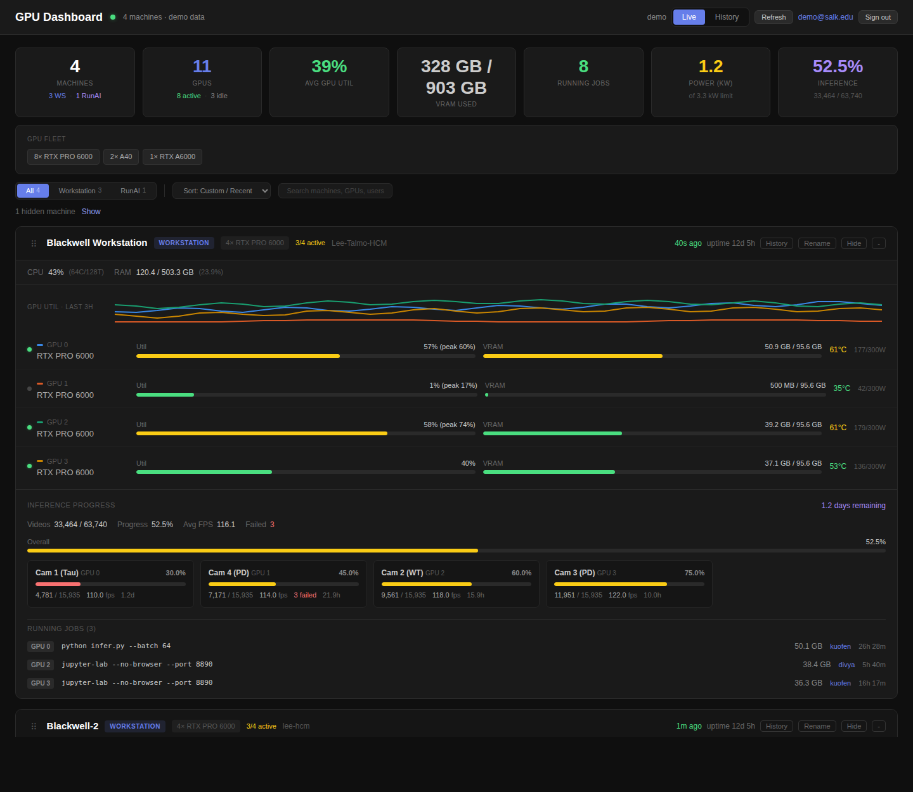

# GPU Dashboard

Monitor the lab's GPUs from one web page, with live status and utilization history. Anyone with a **@salk.edu** email can sign in; no GitHub account or token is needed.



## How It Works

```
Workstation / RunAI agents ──POST (per-machine key)──►  Supabase (Postgres + Auth + Realtime)  ◄──read──  Dashboard (GitHub Pages)
                                                          · gpu_latest    live cards                  ◄──read──  Slack bot & daily report
Machines not yet migrated ──push──► GitHub Gist ──bridge──►  · gpu_samples   history & charts
```

- **Agents post straight to Supabase.** Each machine has its own ingest key (issued with `bridge/issue_key.py`); the `gpu_ingest` function checks the key's hash and writes the snapshot, the latest-per-machine row and one history sample per minute. No GitHub token on the machines, and no GitHub quota: Gist updates are capped at **100 per hour per account**, which a few machines at 30 s intervals exceed on their own.
- **The bridge covers machines still on the Gist.** It copies their Gist snapshots through the same only-if-newer function, so it can never overwrite a fresher direct report. Once every machine has a key, the bridge and the Gist retire.
- **Access is enforced in the database.** Row-level security allows reads only for signed-in users whose email ends in `@salk.edu` (plus an optional allow-list). Writes go through security-definer functions; the service-role key lives only on the bridge host.
- **Preferences are shared.** Renaming, hiding and reordering machines is stored in Supabase, so everyone sees the same layout. "Hide" replaces the old "Remove" (nothing is deleted; the machine keeps reporting).

## What It Shows

The live page is built around one question: **which GPUs are free right now, and who is on the rest?**

| Top of page | Per machine | Per GPU | History tab |
|---|---|---|---|
| Free GPUs / total, machines online, average utilization, VRAM in use, running jobs, power draw | Free-count badge, CPU and RAM, 3-hour utilization sparkline | State (free / busy / offline), utilization with 30-min peak, VRAM, temperature, power | All machines: average utilization and VRAM per machine |
| "GPUs now" strip: one square per GPU, click to jump to the machine | Rename, hide and reorder, shared with everyone | Who is using it: user, command, memory, runtime | Per machine: utilization, VRAM, temperature, power, CPU/RAM per GPU |
| Filters: machine type, "Has free GPU", sort, search | | | Ranges 1h to 90d, table view for every chart |

SLEAP inference progress is not shown here anymore; the **Inference progress** tile and the header link jump to the [HCM Monitor](https://leomeow123.github.io/hcm-dashboard/#inference-panel), which tracks inference and recording health.

GPU states: **busy** = utilization at or above 10%, or processes holding 2 GB or more of VRAM (an idle kernel with a model loaded still owns the GPU; desktop apps below that do not); **recently active** = idle at the last sample but above 30% at some point in the agent's 30-minute peak window (jobs that restart per file look like this between files, so it is not counted as free); **free** = neither; **offline** = the machine has not reported for 10 minutes. A GPU reporting 90%+ utilization with under 64 MB in use and no process is flagged as a likely driver reporting glitch, since no CUDA context can exist in 0 MB.

Agents should push every 30 s (`interval_seconds`); a 5-minute interval makes a momentary reading stick on the page for 5 minutes.

Raw per-minute history is kept for 14 days (configurable); hourly roll-ups are kept indefinitely, so long ranges always work.

## Viewing the Dashboard

1. Open **https://leomeow123.github.io/vibes/gpu-dashboard/**
2. Enter your `@salk.edu` email and click **Send code**.
3. Open the email **in the same browser** and click the sign-in link. You land back on the dashboard, signed in, and stay signed in on that browser. (Once custom SMTP is configured the email carries a 6-digit code instead, which you type into the page.)

The built-in mailer can only send a couple of sign-in emails per hour across the whole lab. If you see "Email limit reached", wait a bit, or ask the maintainer to configure custom SMTP (see below).

Preview without signing in: append `?demo=1` to the URL for synthetic data.

## Quick Start (Add Your Machine)

Unchanged from before. Run this on any machine with `nvidia-smi` and Python:

```bash
pip install psutil requests
curl -sL https://raw.githubusercontent.com/LeoMeow123/vibes/main/gpu-dashboard/agent/install.sh -o /tmp/gpu-install.sh && \
curl -sL https://raw.githubusercontent.com/LeoMeow123/vibes/main/gpu-dashboard/agent/gpu_agent.py -o /tmp/gpu_agent.py && \
SCRIPT_DIR=/tmp bash /tmp/gpu-install.sh
```

The installer asks for the lab Gist ID and token (ask the maintainer), sets up a systemd user service on workstations, and prints tmux/cron instructions on RunAI. Files are also on VAST:

```bash
bash /home/exx/vast/leo/vibing/gpu-dashboard/agent/install.sh    # workstation
bash /root/vast/leo/vibing/gpu-dashboard/agent/install.sh        # RunAI
```

RunAI workspace restarts wipe the agent; re-run the installer and `tmux new -d -s gpu-agent "python3 ~/.local/bin/gpu-agent"` afterwards.

## Maintainer Setup (one-time)

### 1. Database

In the lab Supabase project: **SQL Editor → New query**, paste `supabase/schema.sql`, **Run**. It is idempotent. If the editor limits paste size, run `supabase/parts/part1_of_6.sql` … `part6_of_6.sql` in order instead.

This creates the `gpu_*` tables, the `gpu_is_salk_user()` check, the history functions, the maintenance functions, and adds `gpu_latest` / `gpu_machines` to the Realtime publication. Other tools sharing the project are untouched.

### 2. Authentication

In **Authentication**:

- **Sign In / Providers → Email**: enabled (default). "Confirm email" stays on.
- **URL Configuration** (required): set **Site URL** to `https://leomeow123.github.io/vibes/gpu-dashboard/` and add the same address under **Redirect URLs**. The sign-in link in the email redirects here; without this the link is refused.

Salk's mail security opens links before recipients do, which consumes one-time sign-in links, so the dashboard is set to code-based sign-in (`CODE_IN_EMAIL = true`). That requires the SMTP and template steps below.

**Optional, needs custom SMTP:** Supabase only lets you edit email templates once custom SMTP is configured (or on the Pro plan). After step 3 below, open **Emails → Templates → Magic Link**, put `{{ .Token }}` in the body so the email carries a 6-digit code, e.g.

```html
<h2>GPU Dashboard sign-in</h2>
<p>Your one-time code is</p>
<p style="font-size:28px;font-weight:bold;letter-spacing:4px">{{ .Token }}</p>
<p>Type it into the dashboard page you already have open. It is valid for 1 hour.</p>
```

The dashboard already leads with the code entry (`CODE_IN_EMAIL = true` in `index.html`). Do this for **both** the "Confirm signup" template (first-time users) and the "Magic Link" template (returning users). Leaving the link out means a mail scanner has nothing to consume.

Anyone can *request* a sign-in email, but the database only returns data to `@salk.edu` accounts, so a stray sign-up sees nothing. To admit a collaborator without a Salk address:

```sql
insert into public.gpu_allowed_emails (email, note) values ('someone@ucsd.edu', 'rotation student');
```

### 3. Optional: custom SMTP

Supabase's built-in mailer allows **2 auth emails per hour** per project and locks the email templates. That is workable once everyone is signed in (sessions persist per browser), but onboarding the lab in one afternoon needs more, and the code-in-email flow needs editable templates.

Most SMTP providers (Resend, Postmark, SendGrid) require a verified sending domain, which the lab does not have. The zero-domain option is a Gmail account with an app password:

1. On a Google account you control (a lab Gmail is ideal), turn on 2-step verification, then create an **App password** (Google Account → Security → App passwords).
2. In Supabase: **Authentication → Emails → SMTP Settings** (older layout: **Project Settings → Authentication → SMTP**). Enable custom SMTP with host `smtp.gmail.com`, port `587`, username = the Gmail address, password = the app password, sender email = the Gmail address, sender name `GPU Dashboard`.
3. Under **Authentication → Rate Limits**, raise "emails sent per hour" to something like 30.

Gmail allows about 500 messages per day, far more than the lab will use.

### 4. Direct ingest (migration 002)

Run `supabase/migration_002_direct_ingest.sql` in the SQL editor once. Then, on the bridge host, issue a key per machine and put it in that machine's agent config:

```bash
python3 bridge/issue_key.py blackwell-2          # prints the key once; stores only its sha256
python3 bridge/issue_key.py --list               # which machines have keys
python3 bridge/issue_key.py blackwell-2 --revoke
```

On the machine: add `supabase_url`, `supabase_anon_key` (the publishable key), `ingest_key` and `"push_gist": false` to `~/.config/gpu-dashboard/config.json`, or re-run `agent/install.sh`, then `systemctl --user restart gpu-agent`. The agent log shows `Supabase: … (direct ingest)` on start.

### 5. Bridge (only while some machines still use the Gist)

On one machine that has the agent config (the lab workstation that runs the Slack bot is the natural choice):

```bash
bash /home/exx/vast/leo/vibing/gpu-dashboard/bridge/install.sh
```

It asks for the project URL and the **service_role** key (Project Settings → API Keys; never the anon/publishable key), writes `~/.config/gpu-dashboard/supabase.json` with mode 600, does a dry run, one real pass, and installs the `gpu-bridge` systemd user service.

```bash
systemctl --user status gpu-bridge        # running?
journalctl --user -u gpu-bridge -f        # logs: one line per pass
gpu-bridge --status                       # what Supabase holds
gpu-bridge --dry-run                      # read the Gist, write nothing
```

### 6. Dashboard

`index.html` has the project URL and publishable key near the top of the script (`SUPA_URL`, `SUPA_KEY`). The publishable key is meant to be public; row-level security does the gating. Push to `main` and GitHub Pages serves it. The previous Gist-based page is kept as `legacy.html`.

## Data Model

| Table | Contents | Retention |
|---|---|---|
| `gpu_machines` | one row per machine: label, hostname, type, `display_name`, `hidden`, `sort_order` | forever |
| `gpu_latest` | latest full agent snapshot per machine (JSON, same shape as the Gist file) | latest only |
| `gpu_samples` | per-GPU util / VRAM / temp / power, ~1 row per GPU per minute | 14 days |
| `gpu_host_samples` | CPU / RAM per machine, same cadence | 14 days |
| `gpu_samples_hourly`, `gpu_host_samples_hourly` | hourly averages and maxima | forever |
| `gpu_allowed_emails` | viewers without a Salk address | forever |

Functions viewers can call: `gpu_history`, `gpu_host_history`, `gpu_fleet_history` (bucketed server-side, raw where available and hourly beyond), `gpu_set_order`. Maintenance (service role only): `gpu_rollup_hourly`, `gpu_prune`.

At the current scale (about 13 GPUs) raw history is roughly 20k rows per day, well inside the free tier.

## Slack Integration

Everything Slack lives in `agent/`; secrets live in `~/.config/gpu-dashboard/slack.json` (`webhook`, `bot_token`, `app_token`), never in the scripts.

| What | When | Script |
|---|---|---|
| `/gpu-status` slash command | on demand, reply visible only to you | `slack_bot.py` (systemd user service `gpu-slack-bot`) |
| Daily GPU report | weekdays 8 AM | `slack_status.sh` → `slack_report.py --daily --post` |
| Offline / recovery alert | every 30 min, only on change | `slack_alert.sh` |
| `/hcm-status` | on demand | `slack_bot.py` |

The status message is built once, in `slack_report.py`, from the same Supabase data the dashboard shows (renames and hidden machines included), with the same free / busy / recently active / offline rules. It leads with the number of free GPUs, gives one line per machine (state squares, free count, average utilization, who), adds a **Needs attention** block only when something is wrong (offline machine, driver glitch, GPU above 88 °C, VRAM nearly full), and ends with who is using GPUs and links to the dashboard and the HCM Monitor. The daily report adds one line: last-24-hour fleet utilization with the busiest and quietest machine. No per-process dumps, no inference sections.

```bash
python3 agent/slack_report.py --dry            # preview the status as text
python3 agent/slack_report.py --daily --dry    # preview the daily report
python3 agent/slack_report.py --json           # Block Kit JSON
systemctl --user restart gpu-slack-bot         # after editing slack_bot.py
```

`/gpu-status mine`, `register` and `unregister` still work for personal Gists.

## Agent Usage

```bash
python3 gpu_agent.py              # run continuously (default 30 s)
python3 gpu_agent.py --once       # single snapshot (for cron)
python3 gpu_agent.py --interval 60
python3 gpu_agent.py --dry-run    # print the snapshot without pushing
```

Config lives in `~/.config/gpu-dashboard/config.json` or environment variables:

| Config key | Env variable | Description |
|---|---|---|
| `supabase_url` | `GPU_DASH_SUPABASE_URL` | Project URL (direct ingest) |
| `supabase_anon_key` | `GPU_DASH_SUPABASE_ANON_KEY` | Publishable key (direct ingest) |
| `ingest_key` | `GPU_DASH_INGEST_KEY` | This machine's key from `issue_key.py` |
| `push_gist` | — | Also push to the Gist (default: only when no ingest key) |
| `gist_id` | `GPU_DASH_GIST_ID` | Shared Gist ID (legacy) |
| `github_token` | `GPU_DASH_GITHUB_TOKEN` | GitHub token with `gist` scope |
| `machine_label` | `GPU_DASH_LABEL` | Display name (also the machine key in Supabase) |
| `machine_type` | `GPU_DASH_TYPE` | `workstation` or `runai` |
| `interval_seconds` | — | Push interval (default 120) |

The agent may still attach SLEAP inference / ROI progress summaries to its snapshot for other consumers; the dashboard ignores those fields.

## Security Notes

- Viewers authenticate with Supabase Auth; data access is enforced by row-level security on every `gpu_*` table. Anonymous requests get nothing.
- The service-role key exists only in `~/.config/gpu-dashboard/supabase.json` (mode 600) on the bridge machine.
- The Gist and its token still work exactly as before, but nobody needs them to *view* anything anymore.
- Snapshots include usernames and command lines of GPU processes, as they always did; they are now visible only to Salk accounts.

## Roadmap

Ideas gathered from using the dashboard as a lab tool. Roughly in priority order; nothing here is started unless marked.

### Next up

- **Claim a GPU.** Click a free GPU, enter your name and an expected duration, and everyone sees "reserved by … until …". Claims expire on their own and clear when a process appears. Same shared-prefs mechanism as rename/hide.
- **Notify me when a GPU frees up.** A button on a busy machine that sends a Slack DM the next time a GPU there turns free. Same path gives "machine went offline" and "GPU over 85 °C" alerts.
- **`gpu-pick` command line tool.** Prints the freest GPU on a machine so scripts can do `CUDA_VISIBLE_DEVICES=$(gpu-pick)`.
- **Phase 2 ingest** — *done (migration 002)*: agents post straight to Supabase with a per-machine revocable key. Remaining: migrate every machine, then retire the Gist, the bridge and `slack_alert.sh`'s Gist read.

### Later

- **Usage by person.** Store process users with each history sample; show GPU-hours per user per week and a day-by-hour heatmap of when the fleet is usually free.
- **Machine health beyond GPUs.** Agent reports disk free on home and the VAST mount, driver and CUDA versions, and its own version. Disk-full is what actually kills jobs.
- **Small UI things.** Free-GPU count in the browser tab title; shareable URLs that encode view, machine and range; a compact wall-monitor mode.
- **Slack bot reads Supabase** for everything (the status report already does).

### Shared with the HCM Monitor

- **One visual language.** Same header, a nav strip linking every lab tool (GPU, HCM, Colony, T-maze, Papers), same status colours and card styles from one small shared stylesheet.
- **Phone layout** for both, since people check from home.
- **Freshness everywhere.** Every number says when it was measured and when the next update is due.

### Slack

The bot and the daily report were redesigned to lead with free GPUs, one line per machine, a "Needs attention" block only when something is wrong, and who is using what. Inference progress is linked to the HCM Monitor rather than repeated. See `agent/slack_report.py`.
